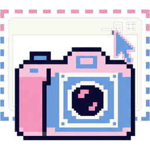

<div align="center">



# EvernightCapture

A command-line window screenshot tool: select windows by conditions, then save that window's pixels to an image file.

[English](README.md) · [简体中文](README.zh-CN.md) · [繁體中文](README.zh-TW.md) · [日本語](README.ja-JP.md)

</div>

Built on a full set of Windows.Graphics.Capture channels. The entry point is `ECAPTURE.EXE` — one executable,
statically linked CRT, no VC++ runtime on the target machine. The output is program-friendly: everything except
`--help` and `--version` is JSON, exit codes are stable, and every diagnostic carries a stable `code`, so the tool
works just as well typed by hand as called from a script or an AI agent.

Current version **0.4.0**: every `--capture` value is implemented (`wgc` / `dwm` / `printwindow` / `bitblt` /
`duplication` / `auto`), and `--monitor` gives whole-screen capture plus "filter windows by monitor". The
previously implemented `magnification` channel was removed (reasons in AGENTS.md).

## Features

- **Select windows by condition**: handle / process id / image name / full path / title (exact, contains, regex) /
  window class — different options AND together, repeating one option ORs it
- **Six capture channels**: capture a window that is covered by something else (`wgc` / `dwm` / `printwindow`), or
  deliberately copy only the pixels visible on screen (`bitblt` / `duplication`)
- **Many windows at once**: `--all` saves one image per matched window, named with placeholders like `%i`
- **Human consent for whole-screen capture**: `--monitor` on a whole screen always shows a modal confirmation
  dialog first — **there is no command-line or environment-variable bypass**
- **Four message languages**: `zh-CN` / `zh-TW` / `en` / `ja`, defaulting to the system display language, all
  embedded as resources inside the exe
- **Machine-readable JSON**: capture results and errors only — no tool name, version, schema or argument echo

## Quick start

You need Visual Studio ("Desktop development with C++" workload) plus the Windows SDK; the build script locates
both automatically.

```powershell
.\build.ps1                                  # Release, output: build\ecapture.exe
ECAPTURE.EXE --process notepad.exe D:\shots\epad.png
```

The output directory must **already exist** — the tool never creates one. To see what would be matched first
(no capture, no file written):

```powershell
ECAPTURE.EXE --process notepad.exe --dry-run --out D:\shots\_probe.png
```

Recipes people actually use:

```powershell
# Pin one window by title plus window class
ECAPTURE.EXE --title LocalSend --class UnityWndClass --out D:\shots\game.png

# Name a window explicitly, using a handle taken from the dry-run candidate list
ECAPTURE.EXE --hwnd 0x001A0B4C --format png --no-overwrite D:\shots\one.png

# One image per matched window, numbered file names
ECAPTURE.EXE --pid 12345 --title-contains Report --all "D:\shots\rpt_%i.png"

# Image bytes on stdout (JSON then moves to stderr)
ECAPTURE.EXE --process notepad.exe --out - 1> D:\shots\snap.png 2> D:\shots\result.json

# Whole screen: always asks for consent, no skip switch exists
ECAPTURE.EXE --monitor primary --out D:\shots\screen.png
ECAPTURE.EXE --monitor all --out "D:\shots\screen_%i.png"
```

## Options

`--opt=value`, `-opt` and `/opt` are all accepted; when a value itself starts with `-` write `--title=-x` or end
option parsing with `--`. Short options **cannot** be combined (`-qi` fails with `cli.unknown_option`). The block
below is the verbatim output of `ECAPTURE.EXE --help`; run `.\scripts\mkreadme.ps1` after changing options —
**do not hand-edit that block**.

<!-- BEGIN ECAPTURE-HELP -->
```text
EvernightCapture (ECAPTURE.EXE) - capture a window selected by conditions, built on Windows.Graphics.Capture

Usage: ECAPTURE.EXE [conditions...] <output-path>     With no conditions at all => this help
       ECAPTURE.EXE [conditions...] --out <path>      "-" means image bytes go to stdout
       ECAPTURE.EXE [conditions...]                    No output path => png bytes to stdout
       ECAPTURE.EXE --monitor [n] <path>         --monitor with no window conditions => that whole screen

Capture target (without --monitor only the window conditions below are used)
  --monitor, -m [<n|primary|all>] Monitor number, 1-based (the order shown by Windows display settings); primary = main monitor, all = one image per monitor. With no window conditions it captures that whole screen; with window conditions only windows overlapping it are matched. The value may be omitted (= primary), and then nothing after it is eaten, so --monitor out.png still works. A whole-screen capture asks for consent in a dialog first, and there is no switch that skips it

Window match conditions (repeat one option for OR, combine different options with AND)
  --hwnd <handle>                 Window handle. Plain digits are decimal; a 0x prefix or a-f digits are hexadecimal - prefer 0x
  --pid <pid>                     Process id, decimal and greater than 0
  --process, -p <image-name>      Image file name (no path), case-insensitive; without an extension .exe is assumed
  --exe <full-path>               Full image path, case-insensitive
  --title, -t <exact-title>       Window title, exact match
  --title-contains, -T <text>     Window title contains this substring
  --title-regex, -R <regex>       Window title regular-expression match (ECMAScript), validated while parsing
  --class, -c <class-name>        Window class name, case-insensitive, e.g. Notepad / CabinetWClass

When several windows match (mutually exclusive)
  --index, -i <n>                 Take the n-th window, 1-based, ordered by visibility and z-order
  --newest                        Take the most recently created window
  --oldest                        Take the oldest created window
  --all, -a                       Save one image per matched window

Capture channel (default wgc; may fail because of the OS version or the window itself)
  --capture, -C <method>          wgc (default, works through occlusion) / dwm (DWM thumbnail, works through occlusion) / printwindow (window paints itself) / bitblt (copies visible screen pixels) / duplication (desktop duplication cropped to the rect) / auto (falls back wgc-dwm-printwindow-bitblt; a whole screen only uses wgc-duplication-bitblt)

Output
  --out, -o <path|->              Output path; the special value - writes image bytes to stdout. A positional argument works too; giving none is the same as --out -
  --format, -f <name>             Force the encoding format; otherwise it comes from the output file extension, and png when that fails too
  --quality <1-100>               JPEG quality, default 100
  --no-overwrite                  Fail instead of overwriting an existing target

Miscellaneous
  --dry-run, -d                   Parse and list candidate windows only - no capture, no file written
  --json, -j                      Deprecated compatibility switch, no effect: success and errors are already JSON
  --verbose, -v                   Add the input section to the JSON (all input, normalized) and keep notes
  --quiet, -q                     Drop notes; errors are always returned whatever this says
  --lang, -l <language>           Message language. auto (default, follows the system display language) / zh-CN / zh-TW / en / ja; unsupported system languages fall back to en
  --help, -h                      Print this text help
  --version                       Print version and stage

Syntax: --opt=value / -opt / /opt all work; when a value itself starts with - write --title=-x, or end option parsing with --
Output: success and failure are both JSON, holding only captured / images (plus errors / notes, and input only with --verbose)
       --help / --version and the no-conditions case are plain text
Exit codes: 0 success / 1 bad arguments / 2 no condition given / 3 --help / 4 no matching window / 5 several matches /
        6 target protected or refused / 7 capture failed / 8 write failed / 9 internal error
Current build: every --capture value is implemented (wgc / dwm / printwindow / bitblt / duplication, auto falls back wgc-dwm-printwindow-bitblt; a whole screen uses wgc-duplication-bitblt); the output directory must already exist

Examples:
  ECAPTURE.EXE --process notepad.exe D:\shots\epad.png
  ECAPTURE.EXE --title LocalSend --class UnityWndClass --out D:\shots\game.png
  ECAPTURE.EXE --pid 12345 --title-contains Report --all D:\shots\rpt_%i.png
  ECAPTURE.EXE --hwnd 0x001A0B4C --format png --no-overwrite out.png
  ECAPTURE.EXE --process notepad.exe --out - > snap.png
  ECAPTURE.EXE --monitor all D:\shots\screen_%i.png
```
<!-- END ECAPTURE-HELP -->

## Matching semantics

Different options are ANDed together (all of them must hit the same window); repeating one option ORs it.
Conditions are never combined across two different windows.

```powershell
ECAPTURE.EXE --process notepad.exe --title-contains Report D:\shots\r.png
# windows whose process is notepad.exe AND whose title contains "Report"
```

- `--title` compares the whole string and `--title-contains` matches a substring; both are **case-sensitive**.
  `--class`, `--process` and `--exe` are case-insensitive.
- Enumeration skips invisible and zero-size windows by default; **minimized windows cannot be captured** and are
  only mentioned separately in the `hint`.
- When several windows match and no disambiguation option was given, the tool refuses to pick one: it reports
  `match.ambiguous_window` (exit code 5) and lists every candidate in `hint`, ordered by z-order.

## Output format

`--help`, `--version` and the "no conditions given" case are plain text. Everything else is JSON carrying only the
capture result and the errors.

A window image (real shape of the output; the numbers come from one actual capture):

```json
{
  "captured": 1,
  "images": [
    {
      "file": "D:\\shots\\EvernightCapture - File Explorer.png",
      "bytes": 60198,
      "width": 1247,
      "height": 607,
      "format": "png",
      "hwnd": "0x001B0C48",
      "pid": 31468,
      "title": "D:\\share\\EvernightCapture - File Explorer",
      "class": "CabinetWClass",
      "image": "explorer.exe",
      "elapsedMs": 156
    }
  ]
}
```

A screen image (`--monitor` with no window conditions) has no window to attribute, so it swaps those fields for
`monitor` / `device` / `primary`, and `hwnd` / `pid` / `title` / `class` / `image` do not appear at all — callers
tell the two kinds apart by checking whether `monitor` exists.

An error (`--hwnd` given a garbage value):

```json
{
  "captured": 0,
  "images": [],
  "errors": [
    {
      "code": "cli.invalid_number",
      "message": "--hwnd needs a valid handle (decimal, or hexadecimal with a 0x prefix)",
      "option": "--hwnd",
      "value": "zzz",
      "hint": "plain digits parse as decimal; write hexadecimal as 0x..., or it is taken as hexadecimal when it contains a-f"
    }
  ]
}
```

Rules:

1. `captured` and `images` are always present (`[]` when empty); `errors` appears whenever it is non-empty
   (`--quiet` cannot suppress it); `notes` appears only when non-empty and not `--quiet`; `input` appears only with
   `--verbose`. Look at `errors` before reading `images`.
2. Empty fields of a diagnostic drop the whole key — there is no `null` placeholder.
3. `code` values are stable: `cli.*` / `note.*` / `match.*` / `capture.*` / `io.*`, append-only, never renamed.
4. Streams: by default everything goes to stdout and stderr stays empty; once the image occupies stdout (explicit
   `--out -`, or no output path at all) the whole JSON moves to stderr. The two streams never mix.
5. `captured` equals the number of `images`; one window per image, and with `--monitor all` one monitor per image.

## Exit codes

`0` success / `1` bad arguments / `2` no condition given / `3` `--help` / `4` no matching window /
`5` several matches / `6` target protected or refused / `7` capture failed / `8` write failed / `9` internal error.
New meanings only ever append numbers.

The exit code and the body are two independent signals; `2`/`3`/`4`/`5` are normal control flow, not crashes.
**Partial success is allowed**: with `--all` or `--monitor all`, if some targets fail the images already written
stay in `images` (`captured` can be greater than 0) while the exit code is `7`.

## Capture channels

| Value | Channel | Covered window | Hardware-accelerated content | Minimum OS |
| --- | --- | --- | --- | --- |
| `wgc` | Windows.Graphics.Capture | yes (DWM cache) | normal | Win10 1803+ |
| `dwm` | DwmRegisterThumbnail | yes | mostly normal, protected windows black | Win7+ |
| `printwindow` | PrintWindow + PW_RENDERFULLCONTENT | yes (window self-draw) | often fully black | Win8.1+ |
| `bitblt` | BitBlt from a screen DC | no, visible pixels only | partly black | all versions |
| `duplication` | DXGI desktop duplication frame, cropped to the rect | no, visible pixels only | normal | Win8+; RDP / virtual GPUs often yield nothing |
| `auto` | falls back wgc → dwm → printwindow → bitblt | best effort | best effort | — |

- Want "the window's own content", even if something is on top of it: keep the default `wgc`. Want "what the screen
  looks like right now", occluder included: use `bitblt` or `duplication`.
- A bad `--capture` value fails during parsing with `cli.unknown_capture_method` (exit code 1) and **never degrades
  to the default channel**; only `auto` may fall back, and a successful fallback emits `note.capture_channel`.
- DRM / protected content is always black. Driver-level black bars (some players) are defeated by some channels and
  not by others — nothing is guaranteed.
- Whole-screen capture only uses `wgc` / `duplication` / `bitblt`; `--monitor` with `dwm` or `printwindow` fails
  during parsing with `capture.unsupported` (exit code 1). In screen mode `auto` falls back wgc → duplication →
  bitblt.

## Whole-screen capture and consent

`--monitor` with no window conditions captures a whole screen, and that **always shows a modal confirmation dialog
first** (it lists the target monitor, the channel, and where the image goes). Only "Yes" lets a frame be taken:

- **No command-line bypass and no environment-variable bypass.** If no dialog can be shown (service session, no
  interactive desktop) it is treated as a refusal.
- Answering "No", or being unable to show the dialog, both give `capture.access_denied` + exit code `6`, no file.
- After "Yes" the tool waits one second before grabbing a frame, so the dialog's close animation is not captured;
  the dialog itself never appears in the image.
- `--dry-run` and "filter windows by monitor" take no whole-screen frame, so no dialog appears.
- To tell "a human refused" apart from "the path was wrong" you must pass `--out` explicitly: without an output
  path every failure collapses into `cli.missing_output` + exit code 1, and the real reason is not leaked.

`--monitor` (value omitted) and `--monitor primary` are the main monitor, `--monitor 2` the second one,
`--monitor all` one image per monitor. Numbers follow the `EnumDisplayMonitors` order and start at 1; out of range
gives `match.monitor_out_of_range` (exit code 1) with every local monitor listed in `hint`. `--monitor <n>` together
with window conditions means "filter windows by monitor" (a window overlapping that monitor matches, and a window
spanning monitors matches on both), still producing window images and no dialog. `--monitor all` is mutually
exclusive with any window **matching** condition (`cli.monitor_conflict`, exit code 1), but disambiguation options
such as `--all` and `--index` do not count as matching conditions and may accompany it.

## File name placeholders

Usable anywhere in the `--out` path; multiple images rely on them:

| Placeholder | Meaning |
| --- | --- |
| `%i` | ordinal, starting at 1 (`--all` windows, `--monitor all` screens) |
| `%h` | window handle, shaped like `0x001B0C48`; screen targets give 0 |
| `%p` | process id; screen targets give 0 |
| `%n` | screen targets give the device name without the `\\.\` prefix (e.g. `DISPLAY1`) |
| `%d` | local date `YYYYMMDD` |
| `%t` | local time `HHMMSS` |
| `%%` | one literal `%`; any other `%x` is kept verbatim |

When `--all` is used without a placeholder the tool appends `_1`, `_2`, … and emits
`note.all_without_placeholder`.

## Message language

`--lang` (`-l`) takes `zh-CN` / `zh-TW` / `en` / `ja`; omitted or `auto` uses the Windows display language, falling
back to `en` when that is not one of the four. Values are accepted generously: case-insensitive, `_` and `-` are
equivalent, `zh_TW` / `zh-Hant` / `cht` / `tw` map to Traditional Chinese, `chs` / `cn` / `zh-Hans` to Simplified,
`jp` to Japanese. An unknown value fails during parsing with `cli.unknown_language` (exit code 1) instead of
silently defaulting.

**Only human-readable text changes with the language**: `message` / `hint` of diagnostics and the whole `--help`.
`code`, JSON keys, value enums, `0x…` handles and `HRESULT` numbers never change, so callers can branch on `code`
alone. The strings are embedded resources (`resources/strings-<language>.txt` compiled as four `RCDATA` blocks), so
switching language works offline.

## Guide for AI and scripts

The tool is designed for programmatic calls; following these conventions is the cheapest way to use it. The
repository also ships a skill that teaches an agent to drive it: `.agents/skills/ecapture-screenshot/` (contains
`SKILL.md`, `references/cli-contract.md`, and a copy of the exe).

1. **Probe with `--dry-run` first**, then disambiguate, then capture for real. `--dry-run` takes no frame and writes
   no file; candidates are in `notes[0].value`, shaped like
   `hwnd=0x001B0C48 pid=31468 1261x614+681+22 class=CabinetWClass title=…`. Note that `--dry-run` still requires
   `--out`, otherwise `cli.missing_output` + 1; and **`--dry-run` alone with no window condition = text help + exit
   code 2**.
2. **Branch on `errors[].code`, never on `message` text** (that follows `--lang`). The codes you actually hit:
   `match.no_window` (4, conditions too narrow or the window is minimized), `match.ambiguous_window` (5, choose
   from the candidates in `hint`), `match.index_out_of_range` / `match.monitor_out_of_range` (1, `hint` lists all
   candidates), `cli.missing_output` (1), `cli.invalid_format` (1), `capture.failed` (7),
   `capture.access_denied` (6), `io.write_failed` (8, directory missing), `io.file_exists` (8, with
   `--no-overwrite`).
3. **Read the right stream**: with `--out <file>` the JSON is on stdout and stderr is empty, so parse stdout
   directly. With `--out -` (or no output path) the image bytes occupy stdout and the whole JSON moves to stderr.
   In PowerShell 5.1 `2>&1` wraps native stderr into error records, so redirect `1>` and `2>` separately if you want
   both the image and the JSON.
4. **Do not treat a non-zero exit code as total failure**: on partial success `captured` is greater than 0 while the
   exit code is 7, and the images already on disk are perfectly usable.
5. **Exit code 0 does not mean the picture is correct**: protected content and some player drivers hand you black
   frames while reporting success. Verify pixels to be sure — for instance put a solid-colour window on top of the
   target and capture again, then check whether you got the target's content or the cover; at minimum compare
   `width`/`height` against the target window rectangle.
6. **Ask a human before capturing a whole screen**: `--monitor` on a full screen pops a modal dialog and blocks the
   process until somebody answers, with no bypass. Don't treat it as a freely available screenshot in automation;
   tell the user first, and pass `--out` explicitly. If you only need one window, don't escalate to the whole
   screen.
7. To reliably target "some application", prefer `--process`/`--exe` plus `--class`; title matching is
   case-sensitive and unreliable across locales.

## Build and test

| Command | Purpose |
| --- | --- |
| `.\build.ps1` | Release build, output `build\ecapture.exe`; `-Config Debug` and `-Clean` available |
| `.\tests\cli.ps1` | 77 output-contract assertions + stream separation + multi-language checks (all `--dry-run`, no capture) |
| `.\scripts\check-lang.ps1` | Verifies the four string tables align on keys/placeholders and that the exe really carries four resources |
| `.\tests\invoker.ps1` | Offline checks for the shared test process invoker: argv quoting, both streams at once, binary output, hung child, per-run scratch dirs (no capture) |
| `.\tests\smoke.ps1` | On-device smoke: capture its own test window → validate PNG size and pixel content |
| `.\tests\channels.ps1` | On-device channel comparison: six channels + occlusion control, against its own windows |
| `.\tests\isolation.ps1` | On-device resource isolation: a same-named process it did not start stays alive and is never the target, two concurrent runs don't cross, an aborted run cleans up only itself |
| `.\tests\screen.ps1` | On-device whole-screen test: consent behaviour + three screen channels + red-block placement + negative control. Only `-SimulateConsent` answers the consent dialog, and only for a desktop dedicated to testing |
| `.\tests\window_shot.bat` | Human walkthrough: compile the test window helper → capture it with every channel → open the screenshot folder → end just that PID |
| `.\scripts\mkreadme.ps1` | Regenerates the help block of all four READMEs from each language's `--help` output |

Every desktop test targets a window of its own: `tests\helper\ec_window.cs` compiles into the run's
scratch folder and the test keeps that PID and HWND, so nothing is ever found or killed by image name and
only the folder it created gets deleted. `tests\harness.psm1` holds the shared process invoker (argv
quoting, both streams drained concurrently, bounded wait, kills only its own process tree) and the scratch
directory / window helpers, and `tests\invoker.ps1` is what proves that invoker.

`build.ps1` uses vswhere to find Visual Studio and prefers its bundled cmake/ninja. Builds must stay warning-free
under `/W4`. When testing by hand in Git Bash, run `export MSYS2_ARG_CONV_EXCL='*'` first — otherwise `/help` gets
rewritten as a path and `--out /tmp/x.png` turns into a mangled one.

## License

EvernightCapture is licensed under the [Mulan Permissive Software License v2 (Mulan PSL v2)](http://license.coscl.org.cn/MulanPSL2).
The complete bilingual (Chinese and English) text is in [LICENSE](LICENSE).

```
Copyright (c) 2025 KagurazakaYashi (KagurazakaMiyabi)
EvernightCapture is licensed under Mulan PSL v2.
```
